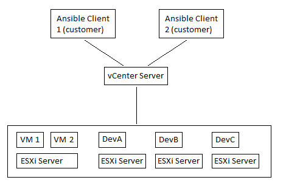

# Environment Setup
## Introduction
This automation lab uses ESXi servers to host the virtual machines in which contain the application.
The servers are administrated by a vCenter server which must be accessed while connected to the
VPN. The customers, QA Engineers, can spin up and monitor testing environments from their local 
machines using the Ansible application, which interacts with the vCenter server. The VMs also
live on the ESXi servers and the QA Engineers must be connected to the VPN to access these
as well.

The diagram below is a simplification meant to show the lab's hierarchy. Dozens of customers
can call resources and a half dozen ESXi servers exist to support guest machines.


### vCenter & ESXi Servers
The lab runs on a series of collocated ESXi servers. These servers are controlled by a
vCenter server which can also monitor and control all active VMs on these servers. The virtual
machines can be copied, spun up, etc. via vCenter, but some operations are easier through
Ansible.
## Ansible
Ansible is a tool that automates IT processes. Ansible talks to vCenter to both monitor
VM instances and also allow for QA Engineers to easily spin up environments with just a few clicks.
Ansible uses two major components: Playbooks and Inventories. Playbooks are the set of instructions
to run, while Inventories set the structure of the environment.

### Playbooks, Inventories & Tower Jobs
Ansible Playbooks are instructions that configure the nodes and are written
in YAML. Here's a piece of a playbook that installs and starts an apache
server on the node:
```yaml
-name: play1
hosts: webserver
tasks:
    -name: install apache
    yum:
      name: apache
      state: present
    -name: start apache
    service:
      name: apache
      state: start
```
Ansible Inventories are files that configure the environment. Here's a simple example:
```text
[webserver]
www.example1.com
www.example2.com
www.example3.com

[database]
db1.machine
```
The data defined in the inventory is referenced in the playbook. The playbook can
then be ran via the command-line. However, this won't be necessary, because Ansible Tower
has a built-in GUI.

Ansible Tower is a framework for Ansible which provides a more user friendly and automated
approach to deploying and managing VMs. Tower Templates are the same as playbooks, but they
additionally allow for certain fields to be customizable. Instead of having three playbooks
that spin up DevA, DevB and DevC individually, the desired resource is stored as a variable. 

In this lab, a Tower template called _Spin Up Dev Instance_ has already been created.
This template will copy the designated Dev VM and spin it up on a separate ESXi server.
The hostname of the guest VM will be based on the individual user. Additionally,
since access to templates can be restricted to certain users and/or teams, only specific
users have access to the template, namely QA Engineers.
### Requesting A Resource
Run the predefined _Spin Up Dev Instance_ tower template from the Ansible Local Client. A 
prompt will ask "Which version of the application should be deployed?", which is where the 
desired resource (DevA, DevB, DevC) should be selected. From here, Ansible will communicate with 
vSphere to clone and spin up the VM. The JSON output contains the networking information for the VM.

### Resources
* [Ansible Tower User Guide](https://docs.ansible.com/ansible-tower/latest/html/userguide/index.html)
* [Ansible User Guide](https://docs.ansible.com/ansible/latest/user_guide/index.html)
* [Ansible & VMware](https://www.ansible.com/integrations/infrastructure/vmware)